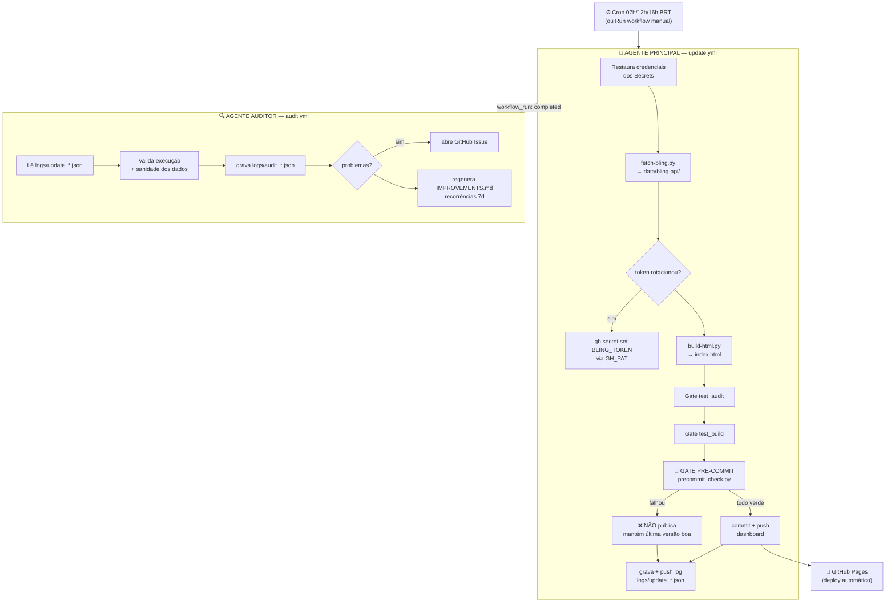

# Easy Analytics — Documentação do Projeto

Dashboard financeiro da **Easy Analytics**, automatizado de ponta a ponta no
**GitHub Actions**. Puxa dados do **Bling** 3×/dia, gera um `index.html` estático,
audita a execução e publica no **GitHub Pages** — sem depender do Mac ligado.

- **Dashboard ao vivo:** https://leandrogelpke.github.io/Easy_Financas/
- **Repositório:** https://github.com/leandrogelpke/Easy_Financas
- **Migrado para GitHub Actions em:** 14/06/2026

> Para o guia de _convenções de código_ (marcadores `@@@`, regras tributárias,
> armadilhas históricas), veja **`CLAUDE.md`**. Este documento (`DOCS.md`) cobre a
> **arquitetura de automação** (workflows, gates, secrets, operação).

---

## 1. Visão geral

| Item | Detalhe |
|---|---|
| **Fonte de dados** | API Bling v3 (OAuth2) — contas a pagar/receber, categorias, contatos |
| **Fontes auxiliares** | Totvs (comissões) e Cartão Bradesco — via snapshots versionados (atualizados localmente) |
| **Saída** | `index.html` estático (~1,1 MB) publicado no GitHub Pages |
| **Cadência** | 3×/dia: **07h00, 12h00, 16h00 (horário de Brasília)** + disparo manual |
| **Infra** | 100% GitHub Actions — nenhuma máquina local precisa estar ligada |
| **Dependências** | Apenas Python 3.11 stdlib (zero `pip install`) |

**Princípio central:** todo número no dashboard vem de dado vivo (Bling/Totvs/
auditoria). Nada é hardcoded. Se um dado ou artefato sai inválido, o **gate
pré-commit bloqueia a publicação** e a última versão boa permanece no ar.

---

## 2. Arquitetura — os dois agentes



### 2.1 Há DOIS níveis de auditoria (importante)

| | **Gate pré-commit** | **Auditor pós-commit** |
|---|---|---|
| Arquivo | `ci/precommit_check.py` | `ci/ci_auditor.py` + `audit.yml` |
| Quando | Dentro do update, **após build, antes do commit** | Em workflow separado, **após o update terminar** |
| Tipo | **Gate duro** — bloqueia a publicação | **Analítico** — reporta, não bloqueia |
| Em falha | Não publica; mantém a última versão boa no ar; run fica vermelho | Abre Issue + atualiza `IMPROVEMENTS.md` |
| Objetivo | Impedir que dado/artefato ruim vá ao ar | Aprendizado contínuo / feedback ao agente principal |

> Essa separação responde à pergunta "tem auditor que roda antes de comitar?":
> **sim** — o `precommit_check.py`. O `ci_auditor.py` é a camada de feedback que
> roda depois.

---

## 3. Agente Principal — `update.yml`

Passo a passo de cada execução:

1. **Checkout** + **Setup Python 3.11**.
2. **Restaura credenciais** — escreve `.bling-oauth.json` e `.bling-tokens.json`
   a partir dos Secrets `BLING_OAUTH`/`BLING_TOKEN`; valida que são JSON.
3. **Fetch Bling** — `fetch-bling.py --out data/bling-api --data-inicial <7 meses atrás>
   --no-detail-receber`. Gera CSVs + `bling_data_AAAA-MM-DD.json`.
4. **Salva token rotacionado** — se o `fetch` renovou o token (arquivo mudou),
   regrava o Secret `BLING_TOKEN` via `gh secret set` usando `GH_PAT`. **Crítico**
   (ver §5).
5. **Build** — `build-html.py --in data/bling-api --out index.html`, com
   `TOTVS_SNAP=data/bling-api/totvs_snapshot.json` e `CARTAO_SNAP=cartao_snapshot.json`.
6. **Gate `test_audit.py`** — trava regressão tributária (alíquotas, parsers,
   reconciliação).
7. **Gate `test_build.py`** — trava regressão estrutural do HTML (marcadores,
   divs balanceadas, nº de abas, tamanho).
8. **Gate pré-commit `precommit_check.py`** — valida os artefatos recém-gerados
   (ver §6).
9. **Commit & push do dashboard** — **só roda se 3–8 passaram todos.** Commita
   `index.html` + `bling_data_*.json` (mantém os 10 mais recentes).
10. **Grava + push do log** — `logs/update_AAAA-MM-DD_HH.json` (sempre, mesmo em
    falha).
11. **Falha o job** se qualquer etapa crítica não passou (deixa o run vermelho e
    visível).

**Crons (UTC → BRT):** `0 10` → 07h · `0 15` → 12h · `0 19` → 16h.
**Disparo manual:** botão _Run workflow_ na aba Actions, ou
`gh workflow run update.yml`.

---

## 4. Agente Auditor — `audit.yml` + `ci/ci_auditor.py`

Dispara via `workflow_run` (logo que o agente principal termina, em qualquer
conclusão) e também por disparo manual.

O `ci_auditor.py`:

1. Localiza o `logs/update_*.json` mais recente.
2. Avalia a execução: fetch ok, registros completos, build ok, gates verdes,
   gate pré-commit, push ok, rotação de token.
3. Sanidade dos dados (sobre o snapshot publicado): % de `contato_nome` vazio,
   `valor` vazio, datas implausíveis, queda anômala de volume vs. execução
   anterior.
4. Padrões de falha recorrentes nos últimos 7 dias.
5. Grava `logs/audit_AAAA-MM-DD_HH.json` (achados + recomendações).
6. Se houver erro/aviso → abre **GitHub Issue** com label `auditoria-automatica`
   (dedupe por janela, título `⚠️ Auditoria DD/MM HH:MM: ...`).
7. Regenera **`IMPROVEMENTS.md`** com recomendações que apareceram em **2+
   auditorias nos últimos 7 dias** — o canal de feedback para revisão humana.

> O auditor **nunca** altera os HTMLs publicados — só analisa, reporta e sugere.

---

## 5. Rotação do token Bling (mecanismo crítico)

O Bling usa OAuth2 com **refresh token rotativo**: o `access_token` expira em **6
horas** e, a cada renovação, o Bling **invalida o `refresh_token` antigo e emite
um novo**.

Como o GitHub Actions é stateless, um Secret estático morreria após a 1ª
execução. Solução implementada:

1. O Secret `BLING_TOKEN` guarda o `.bling-tokens.json` completo.
2. No início do run, é feita uma cópia de referência (`.bling-tokens.orig.json`).
3. O `fetch-bling.py` renova o token e reescreve `.bling-tokens.json`.
4. O passo "Salvar token rotacionado" compara os dois; se mudou, executa
   `gh secret set BLING_TOKEN` (autenticado com **`GH_PAT`**) — o Secret é
   atualizado para a próxima execução.

**Sem o `GH_PAT`, a automação quebraria após ~6h.** O passo emite um
`::warning::` se o token rotacionar e o `GH_PAT` estiver ausente.

**Re-autenticação manual** (só se o `refresh_token` ficar >~30 dias sem uso e
expirar de vez): rodar `python3 bling-auth.py` localmente no Mac (com
`.bling-oauth.json` presente), depois
`gh secret set BLING_TOKEN < .bling-tokens.json`.

---

## 6. Gate pré-commit — `ci/precommit_check.py`

Roda após o build, antes do commit. Sai com código ≠ 0 (bloqueia) em qualquer
**problema crítico**:

- snapshot `bling_data_*.json` ausente, ilegível ou com **0 registros**;
- dataset-núcleo vazio (`contas_pagar_pagas` ou `contas_receber_recebidas`);
- `index.html` ausente, **< 500 KB**, com **marcadores `@@...@@`** não
  substituídos, ou **< 12 abas** `.pg`;
- **auditoria com 0 findings** → sinaliza abas Auditoria/P&L/DRE/Contas vazias
  (regressão clássica quando o `TOTVS_SNAP.parent` não tem os CSVs — ver §10).

**Avisos** (não bloqueiam): `audit_findings.json`/`contas_snapshot.json`
ausentes; queda de volume > 60% vs. snapshot anterior.

---

## 7. Secrets do GitHub

| Secret | Conteúdo | Usado para |
|---|---|---|
| `BLING_TOKEN` | `.bling-tokens.json` (access + refresh token) | autenticar no Bling; **auto-atualizado a cada rotação** |
| `BLING_OAUTH` | `.bling-oauth.json` (client_id/secret) | renovar o access_token |
| `GH_PAT` | Personal Access Token (escopo `repo`) | regravar o Secret `BLING_TOKEN` após rotação |

Configurar/atualizar:
```bash
gh secret set BLING_TOKEN  --repo leandrogelpke/Easy_Financas < .bling-tokens.json
gh secret set BLING_OAUTH  --repo leandrogelpke/Easy_Financas < .bling-oauth.json
gh auth token | gh secret set GH_PAT --repo leandrogelpke/Easy_Financas
```

> **Credenciais nunca são commitadas** — `.gitignore` exclui `.bling-*` e
> `.git-token-store`. Elas vivem só nos Secrets.

---

## 8. Estrutura de arquivos

### Workflows e CI
```
.github/workflows/update.yml   # agente principal (3x/dia + manual)
.github/workflows/audit.yml    # agente auditor (encadeia após o principal)
ci/precommit_check.py          # GATE duro pré-commit
ci/write_update_log.py         # grava logs/update_*.json
ci/ci_auditor.py               # auditor pós-commit (Issues + IMPROVEMENTS.md)
```

### Pipeline de dados (scripts Python)
```
fetch-bling.py     # pull do Bling → CSVs + bling_data_*.json
build-html.py      # template.html + dados → index.html (orquestrador do render)
audit.py           # auditoria tributária (CONFIG = fonte única de alíquotas)
dre_render.py      # matriz contábil que abastece DRE + audit
contas_view.py     # abas A Pagar / A Receber
totvs_render.py    # aba Comissões Totvs
cartao_render.py   # aba Cartão
chat_widget.py     # widget de busca/chat
fetch-totvs.py     # (local) processa .eml/.xlsx do Drive → totvs_snapshot.json
fetch-cartao.py    # (local) parseia faturas PDF → cartao_snapshot.json
test_audit.py      # gate de regressão tributária
test_build.py      # gate de regressão estrutural do HTML
```

### Dados versionados
```
template.html                       # fonte do dashboard (marcadores @@@)
index.html                          # saída publicada (gerada pelo CI)
clientes_classificacao.json         # classificação de risco de clientes
caixa_config.json                   # saldo em caixa (Runway) — manual
retencoes_compensadas.json          # retenções já compensadas — manual
cartao_snapshot.json                # snapshot do Cartão (atualizado localmente)
data/bling-api/totvs_snapshot.json  # snapshot Totvs (junto dos CSVs do Bling)
data/bling-api/bling_data_*.json    # snapshots Bling (10 mais recentes)
logs/update_*.json                  # log de cada execução do principal
logs/audit_*.json                   # relatório de cada auditoria
IMPROVEMENTS.md                     # recomendações recorrentes (auto)
```

### Não versionado (`.gitignore`)
Credenciais (`.bling-*`, `.git-token-store`, `.bling-api-key`), `__pycache__/`,
CSVs e `.cache/` em `data/bling-api/`, dados brutos sensíveis (`cartao/raw/`,
`totvs/raw/`).

---

## 9. Arquivos de configuração manual

São mantidos à mão (como o `clientes_classificacao.json`) porque o Bling não
expõe esses dados:

### `caixa_config.json` — Runway
```json
{ "saldo_caixa": 515.75 }
```
Saldo atual em conta (R$). Alimenta o card **Runway (caixa ÷ burn)** na Visão
Geral. `null` → o card mostra a chamada para configurar. Atualize a cada
conferência de extrato.

### `retencoes_compensadas.json` — Crédito tributário
```json
{ "compensado_total": 0 }
```
Total de retenções na fonte (CSRF 4,65% + IRRF 1,5%) **já compensado** contra
DARF, conforme apuração do Serrano. Alimenta o card **Retenções na fonte —
crédito tributário** (aba Auditoria): retido estimado − compensado = saldo a
compensar.

---

## 10. Operação — tarefas comuns

**Disparar uma atualização manual**
```bash
gh workflow run update.yml --repo leandrogelpke/Easy_Financas
gh run watch $(gh run list --workflow=update.yml -L1 --json databaseId --jq '.[0].databaseId')
```

**Atualizar o saldo em caixa (Runway)** — edite `caixa_config.json`, commite e
dispare um run (ou espere o próximo ciclo).

**Atualizar Totvs/Cartão** (precisam do Drive/Mac): rode o `weekly.sh` local; ele
regenera `totvs_snapshot.json`/`cartao_snapshot.json`. Em seguida commite os
snapshots — o CI passa a usá-los. **`totvs_snapshot.json` deve ficar em
`data/bling-api/`** (o build deriva o diretório dos CSVs do Bling de
`TOTVS_SNAP.parent`; se ele apontar para outro lugar, as abas Auditoria/P&L/DRE/
Contas ficam vazias — o gate pré-commit pega isso).

**Ver o estado dos workflows**
```bash
gh run list --repo leandrogelpke/Easy_Financas -L 10
gh run view <run-id> --log
```

---

## 11. Logs e relatórios

- **`logs/update_AAAA-MM-DD_HH.json`** — por execução do principal: timestamps,
  status de cada etapa (`fetch`, `token_refresh`, `build`, gates, `precommit`,
  `push`), contagem de registros por dataset, `commit_hash`, erros/avisos.
- **`logs/audit_AAAA-MM-DD_HH.json`** — por auditoria: summary
  (erros/avisos/info/ok), findings com recomendações, links.
- **`IMPROVEMENTS.md`** — recomendações recorrentes (2+ vezes em 7 dias),
  regenerado a cada auditoria.
- **GitHub Issues** (label `auditoria-automatica`) — abertas quando a auditoria
  encontra problemas.

`HH` é a hora BRT da janela (07/12/16 nos ciclos agendados).

---

## 12. Troubleshooting

| Sintoma | Causa provável | Ação |
|---|---|---|
| Run vermelho, "publicação bloqueada" | Gate pré-commit ou teste falhou | Ver log do step que falhou; dashboard manteve a última versão boa |
| Abas Auditoria/DRE/Contas vazias | `TOTVS_SNAP.parent` sem os CSVs | Garantir `totvs_snapshot.json` em `data/bling-api/`; o gate pré-commit já bloqueia esse caso |
| Fetch falha com 401/inválido | `refresh_token` expirou (>30d sem uso) | Re-autenticar local (`bling-auth.py`) e atualizar `BLING_TOKEN` (§5) |
| Token não persiste após rotação | `GH_PAT` ausente/expirado | `gh auth token \| gh secret set GH_PAT` |
| Dashboard não atualiza no navegador | Cache do Pages | `Ctrl+Shift+R` (force reload); Pages leva 1–2 min p/ propagar |
| `git` local corrompido (iCloud) | iCloud bloqueia `.git/` | Operar via clone temporário em `/tmp` (padrão do `weekly.sh`) |

---

## 13. Limitações conhecidas

- **Totvs e Cartão não atualizam na nuvem** — dependem do Google Drive/Mac. O CI
  atualiza só o Bling 3×/dia e reusa o último snapshot dessas abas.
- **Runway depende de entrada manual** — o Bling não expõe saldo bancário
  (`caixa_config.json`).
- **"Compensado" das retenções é manual** — o Bling não faz o matching
  retido↔DARF (`retencoes_compensadas.json`).
- **Repositório público** — exigência do GitHub Pages gratuito. Ver §14.

---

## 14. Segurança

- **Credenciais** ficam só nos Secrets; nunca no repositório.
- **Repositório é público** (necessário para o Pages gratuito) e o `index.html`
  está nele → os **dados financeiros são acessíveis** via
  `raw.githubusercontent.com`. A senha do dashboard é **client-side** (só esconde
  a UI). Para sigilo real, seria necessário repo privado + Pages no plano pago,
  ou um proxy autenticado.
- **`GH_PAT`** tem escopo amplo (`repo`). Se comprometido, pode gerenciar o
  repositório e Secrets. É o mesmo token já usado para push.

---

## 15. Referência rápida

| | |
|---|---|
| Horários | 07h00 · 12h00 · 16h00 BRT (3×/dia) |
| Auditor | encadeia após cada execução do principal |
| Disparo manual | `gh workflow run update.yml` |
| Secrets | `BLING_TOKEN`, `BLING_OAUTH`, `GH_PAT` |
| Gate duro | `ci/precommit_check.py` (bloqueia publicação ruim) |
| Dashboard | https://leandrogelpke.github.io/Easy_Financas/ |
| Convenções de código | `CLAUDE.md` |
